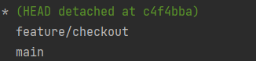

# 되돌리기
- `checkout` 사용시 쉽게 마지막 커밋으로 되돌아갈 수 있다. ❓
- sourceTree의 코드뭉치 버리기 기능 사용도 좋다. ✅  
단, 새 파일은 인덱스에 추가가 되지않아 안되고, 기존 파일 변경사항만 변형 가능. Unstaged file 되돌릴 때 편함. 

- Jetbrain IDE 에서는 그냥 라인 왼쪽에서 `Rollback Lines` 나 commit 창에서 취소해줘도 쉽다. ✅

> commit 한걸 되돌릴라면? \
`git reset`
> 
> ⚠️checkout 이 다른 브랜치를 가리키는 경우 'detached' 라고 메시지가 뜬다.

---
##  `reset` vs `checkout`

### reset
특정 커밋 시점으로 되돌리며 3가지 옵션을 지원한다.
```bash
$ git reset --[OPTION] [COMMIT-HASH]
```
#### Options
- soft \
해당 commit 시점으로 돌아가며 그 이후 시점 변경 사항은 staging 상태를 유지한다.
- mixed \
해당 commit 시점으로 돌아가며 그 이후 시점에 변경 사항을 unstaged 상태로 되돌린다.
- hard \
해당 commit 시점으로 돌아가며 그 이후 시점 변경 사항을 아예 삭제해버린다. \
  ⚠️ex. 추가되었던 파일이나 디렉토리 삭제

### checkout
브랜치를 변경하거나 \
특정 commit 시점으로 HEAD 이동 (Detached HEAD) // _이는 branch 의 포인터로부터 분리됨을 의미_



