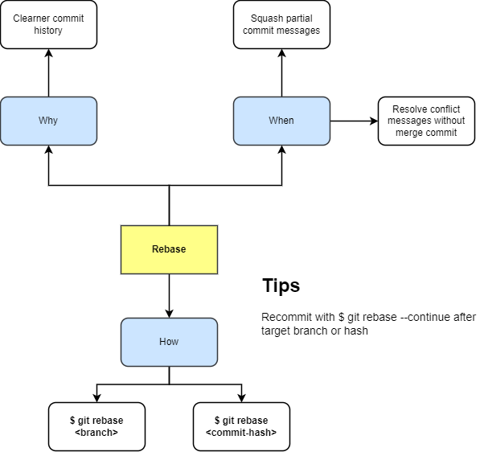

# Rebase
base 위치를 뚝 시치미뗀다.

원래 근본을 뽑아와야한다.

## Scenario
1. Make `feature/c` and `feature/c2` branch
2. feature/c commit 2 logs
3. Merge `feature/c` into `develop` \
Merge commit is created.
4. `feautre/c2` commit 2 logs
5. `feature/c2` rebase to current `origin/develop`
Conflict here between `feature/c` and `feature/c2`.

### Summary

